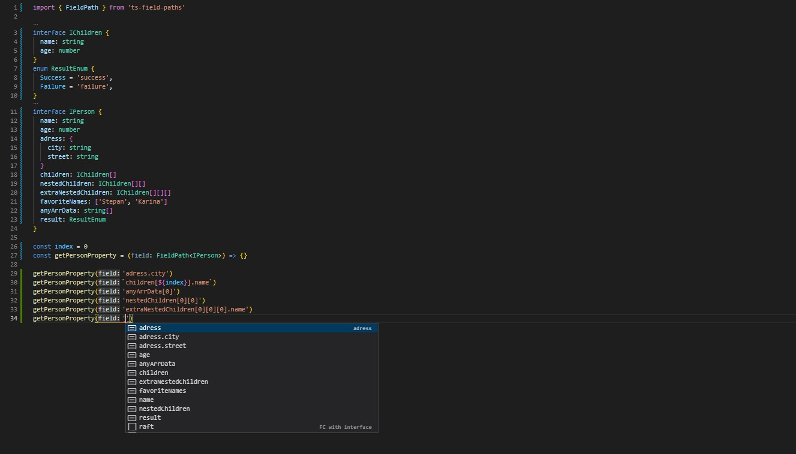

<h1 align="center">Ts-field-paths</h1>
<h4 align="center" fo>
  Ts-field-paths is a library for strongly typing an object's property path, including nested properties and even arrays.
</h4>

### Install

```
yarn add -D ts-field-paths
```

### Requirements

This library uses Template Literal Types, so TypeScript 4.1<= is required

### 🐇 Quick start

```jsx
    import { FieldPath } from 'ts-field-paths'

    interface IChildren {
      name: string
      age: number
    }
    enum ResultEnum {
      Success = 'success',
      Failure = 'failure',
    }
    interface IPerson {
      name: string
      age: number
      adress: {
        city: string
        street: string
      }
      children: IChildren[]
      nestedChildren: IChildren[][]
      extraNestedChildren: IChildren[][][]
      favoriteNames: ['Stepan', 'Karina']
      anyArrData: string[]
      result: ResultEnum
    }

    const index = 0
    const getPersonProperty = (field: FieldPath<IPerson>) => {
      // used for example in lodash get _.get(path)
    }

    getPersonProperty('adress.city')
    getPersonProperty(`children[${index}].name`)
    getPersonProperty('anyArrData[0]')
    getPersonProperty('nestedChildren[0][0]')
    getPersonProperty('extraNestedChildren[0][0][0].name')
    getPersonProperty('adress')
```

### ✨ Awesome autocomplete


